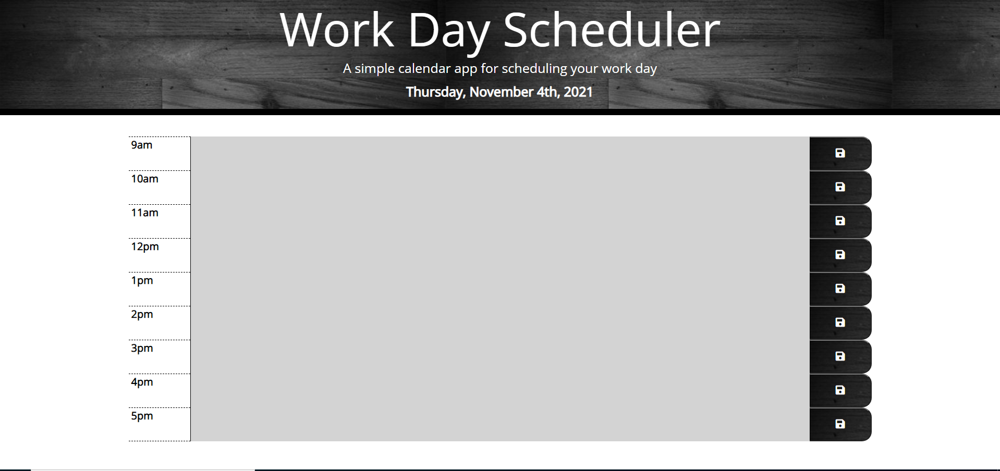

# Work Day Scheduler Starter Code

**Description**

This is a work day scheduler that dynamically pulls in the current day at the top of the screen. The work day hours are listed here with a notes section for each hour. The notes section provides a place to add reminders or comments pertaining to that specific hour of the day. Once the notes are entered and the save icon is pressed those notes are saved and will remain visible on the screen. To clear the notes you must click into the notes and delete the contents and press the save icon.  The current or present hour will be highlighted in redish-orange, the past hours will be highlighted in grey and the future hours will be highlighted in green.

**Website Screen Shot**

**Website Link**

https://kimberlyamaya.github.io/work-day-scheduler/

**GitHub Link**

https://github.com/kimberlyamaya/work-day-scheduler

**Editors**

* Starter code was provided by UC Davis Boot Camp via GitHub
* Kimberly Amaya
